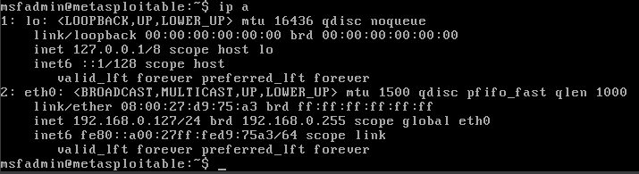
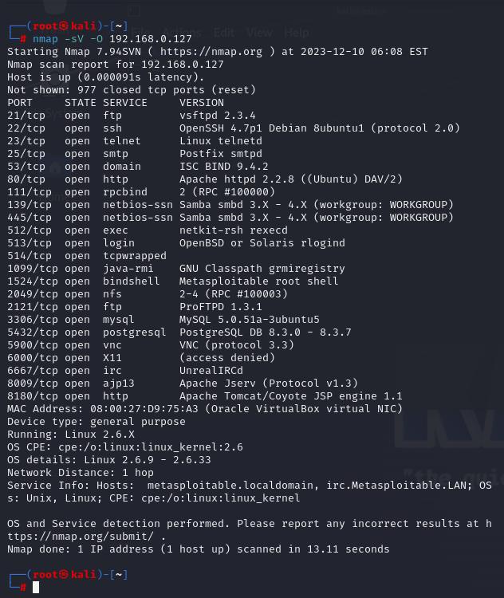
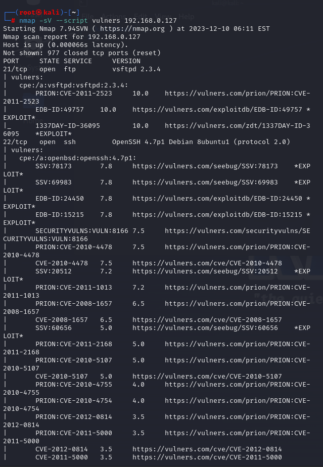

# Домашнее задание к занятию «Уязвимости и атаки на информационные системы»

### Задание 1

Скачайте и установите виртуальную машину Metasploitable: https://sourceforge.net/projects/metasploitable/.

Это типовая ОС для экспериментов в области информационной безопасности, с которой следует начать при анализе уязвимостей.

Просканируйте эту виртуальную машину, используя **nmap**.

Попробуйте найти уязвимости, которым подвержена эта виртуальная машина.

Сами уязвимости можно поискать на сайте https://www.exploit-db.com/.

Для этого нужно в поиске ввести название сетевой службы, обнаруженной на атакуемой машине, и выбрать подходящие по версии уязвимости.

Ответьте на следующие вопросы:

- Какие сетевые службы в ней разрешены?
- Какие уязвимости были вами обнаружены? (список со ссылками: достаточно трёх уязвимостей)
  
*Приведите ответ в свободной форме.*  

# Ответ

- **после установки Kali Linux и Metasploitable поднимаю сетевой интерфейс**



- **запускаю сканирование** *(ключ -sV покажет версии служб и сервисов на открытых портах, а -O покажет версию ОС)*
```bash script
nmap -sV -O 192.168.0.127
```



- **так же, можно использовать** ```--script vulners``` **для получения дополнительной информации об уязвимосятх**



### Найденные уязвимости:

- **FTP** - устаревшая версия FTP-сервера vsftpd 2.3.4, которая имеет уязвимости (https://www.exploit-db.com/exploits/17491)
-  **Telnet** - его использование является небезопасным, поскольку данные передаются в открытом виде. Существует большое количество эксплойтов. Лучше использовать SSH.
-  **DNS** - позволяет удаленно влиять кэш (https://www.exploit-db.com/exploits/6122)

### Задание 2

Проведите сканирование Metasploitable в режимах SYN, FIN, Xmas, UDP.

Запишите сеансы сканирования в Wireshark.

Ответьте на следующие вопросы:

- Чем отличаются эти режимы сканирования с точки зрения сетевого трафика?
- Как отвечает сервер?

*Приведите ответ в свободной форме.*
